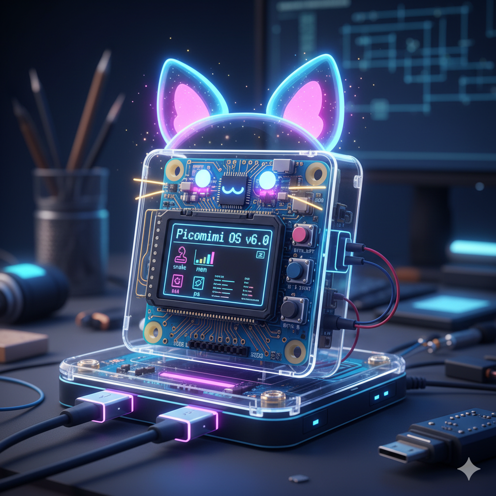

# Picomimi

Picomimi is a tiny, playful "OS/kernel"... kinda thing for the **RP2040**. Arduino-IDE-ready and easy to use, it's built for casual tinkering, fun experiments, and bare-metal chaos—bringing Arduino-style simplicity to your Pico projects while letting you push the microcontroller to its limits - Simple and cute **(＾_＾)**.

Picomimi is more than just an Arduino `loop()`—it introduces a **lightweight, task-based system** on your Pico. You can run multiple tasks, interact with the "kernel" through a serial shell, and explore system behaviour in real-time. It's built for **playful experimentation** and learning, offering a tiny playground for microcontroller enthusiasts.


*Picomimi ready for fun experiments! - AI-generated image, for fun, don't judge.*

---

## Features

* **Tiny, Easy-to-Use "Kernel":** Designed for simplicity and Arduino IDE upload, Picomimi runs straight out of the box on RP2040 boards.
* **Task-Based System:** Supports multiple tasks running concurrently in a cooperative multitasking model. Great for experimenting with scheduling and task management.
* **Interactive Shell:** Connect via serial using:

    ```bash
    picocom /dev/ttyACM0 -b 115200
    ```

    Use the shell to inspect tasks, check memory usage, and interact with the system in real time.
* **Memory Management:** Includes a small heap and basic memory tracking to explore dynamic memory allocation on a microcontroller.
* **Driver Tasks:** Modular drivers for display, input, and monitoring hardware are implemented as tasks for easy experimentation.
* **Task Lifecycle Control:** Create, suspend, resume, and terminate tasks interactively. Learn the basics of OS-style task management on tiny hardware.

---

## Dependencies

To compile and upload Picomimi using the **Arduino IDE**, make sure you have the following installed:

1.  **RP2040 / Raspberry Pi Pico board support**

    * Go to **File → Preferences → Additional Boards Manager URLs** and add:

        ```
        [https://github.com/earlephilhower/arduino-pico/releases/download/global/package_rp2040_index.json](https://github.com/earlephilhower/arduino-pico/releases/download/global/package_rp2040_index.json)
        ```

    * Then open **Tools → Board → Boards Manager**, search for `Raspberry Pi RP2040` and install the package.

2.  **Required Libraries** (install via **Sketch → Include Library → Manage Libraries**):

    * **Adafruit GFX Library** (for graphics support)
    * **Adafruit ILI9341** (for display control)
    * **SPI** (built-in with Arduino IDE)

> **Note:** The RP2040 SDK headers (`hardware/adc.h`, `hardware/watchdog.h`, `hardware/sync.h`, `pico/platform.h`) are included automatically with the board package—you don't need to install them manually.

---

## Recommended Setup

* **Overclocking:** For smoother performance, overclock your RP2040 to **225 MHz, 240 MHz, 250 MHz, or 276 MHz**.
* In the Arduino IDE, set **“Optimize Even More (-O3)”** under the optimization settings.
* **Serial Terminal:** Use `picocom` or another serial terminal at **115200 baud** to interact with the Picomimi shell.

---

## Getting Started

1.  Install **Arduino IDE** and the RP2040 board support package.
2.  Clone or download the **Picomimi** repository.
3.  Open the main `.ino` file in Arduino IDE.
4.  Make sure the dependencies listed above are installed.
5.  Upload the sketch to your RP2040.
6.  Open a serial terminal and start interacting with the Picomimi shell.

Picomimi is meant to be **lightweight, approachable, and fun**. It's small enough to be uploaded quickly, easy enough to play with immediately, and encourages experimentation with **tasks, memory, and hardware peripherals**.

Picomimi is messy, broken, honestly just bad, but it's a fun project (￣︿￣)
- Disclaimer: This is a project made heavily with AI, though I have coded many many parts in this project too; I am a hardware enthusiast, not a programmer. (⇀‸↼‶)

**NOTE:**
This project is compatible with most RP2040 boards and provides terminal commands via serial. Missing hardware won’t break the system — the Picomimi kernel will simply ignore any components that aren’t connected, so no code modifications are required. Picomimi will operate even without any modules connected. Unlike my Picomimi-Board, it can operate happily on a bare RP2040.
