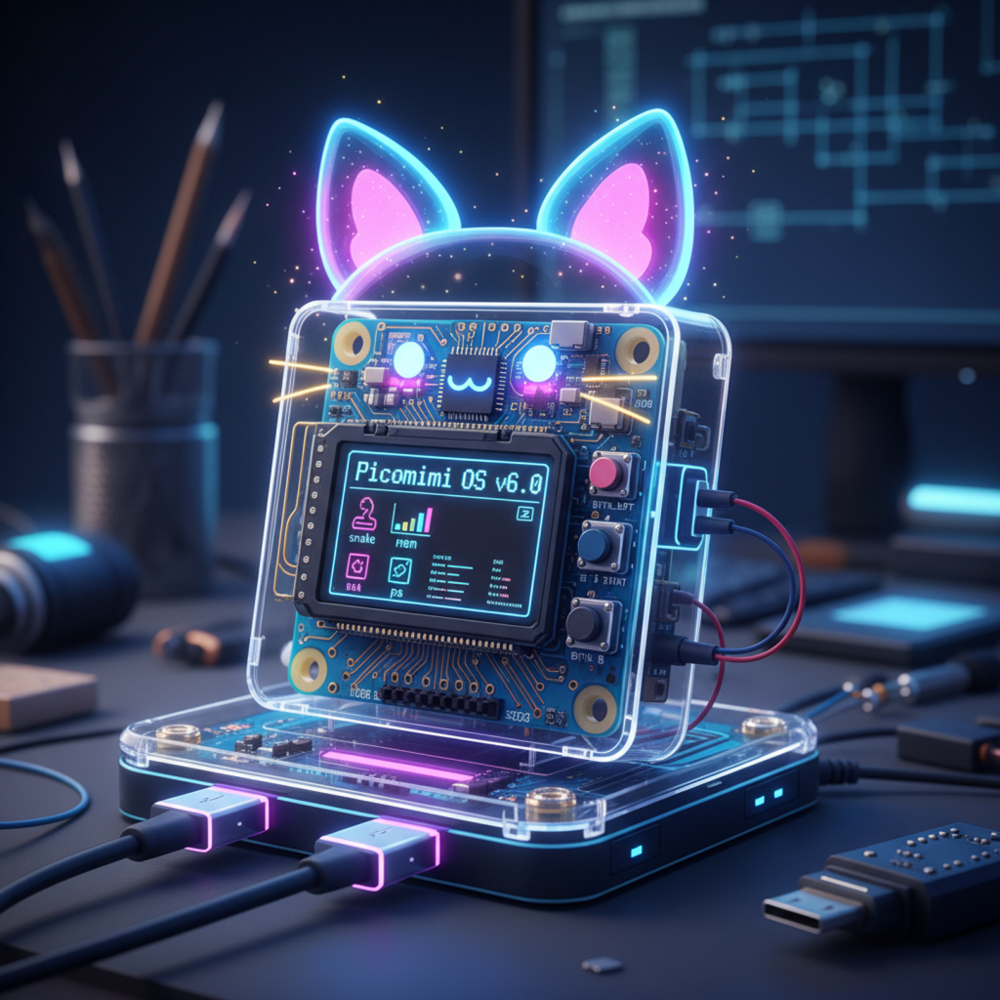

# **Picomimi MicroOS**

> 🐱 **Modular Development Workflow (v13+):**
> Picomimi is now **fully modular**. The kernel is split into 32 focused modules for easier development, version control, and collaboration. The **MEOW Toolchain** provides working tools to split, edit, and reassemble the codebase seamlessly.
>
> **Benefits:**
>
> * Edit individual modules without navigating massive files
> * Better git diffs and merge conflict resolution
> * Clean separation of kernel components
> * **Professional tooling** with MEOW (MicroOS Engineering Orchestration Workbench)
> * **Same simple Arduino IDE workflow** — reassemble with one command
>
> The development process is now **modular and maintainable** while deployment remains **monolithic and simple**. ฅ(•ㅅ•❀)ฅ

---

**Picomimi is an embedded MicroOS *distribution* for RP2040 and RP2350 microcontrollers.**

Rather than positioning itself as a traditional RTOS, Picomimi treats the microcontroller as a **small, persistent computing system** — combining a kernel, core services, filesystem, shell, tooling, and application framework into a single coherent platform.

Picomimi is designed to be **hackable, learnable, and practical**. It provides a unified dual-core microkernel, task scheduling, IPC, memory management, filesystem support, mini-RTOS primitives, and an interactive shell — everything needed to build long-running, inspectable embedded systems that behave more like tiny computers than disposable firmware images. See [AxisOS](https://github.com/MilkmanAbi/AxisOS) project.

The kernel is **fully open and editable**. You can modify scheduler behavior, tweak IPC, adjust memory policies, extend the filesystem, or focus entirely on building applications with exposed APIs. Picomimi provides **maximum control and learning potential** while remaining **fast, readable, and buildable using only the Arduino IDE** — no CMake, no complex toolchains, no opaque scripts.

---


*Picomimi ready for hacking! ฅ(•ㅅ•❀)ฅ*

---

## **Project Philosophy**

Picomimi is built around **transparency, hackability, and system-level thinking**:

* **The kernel is yours:** rewrite or tweak the scheduler, memory manager, IPC system, filesystem, or system calls freely.
* **Applications first:** build and run long-lived tasks without boilerplate.
* **Learning through experimentation:** inspect kernel state, extend services, and adjust behavior at runtime.
* **Minimal but capable:** small enough to understand end-to-end, but powerful enough to act as a real system.
* **Distribution-level tooling:** MEOW makes kernel-scale refactoring practical.
* **Simple deployment:** Arduino IDE only — fast iteration, direct upload.

Picomimi is both a **MicroOS and a development platform**, designed to let you experiment with embedded system design holistically.

---

## **What Picomimi Is (and Isn’t)**

Picomimi is **not** a drop-in RTOS replacement and does not attempt to compete with FreeRTOS, Zephyr, or commercial RTOSes on certification, hard real-time guarantees, or minimal footprint.

Instead, Picomimi is:

* An **embedded distribution**, not just a kernel
* A **persistent system** with storage, logs, upgrades, and recovery
* A **hackable platform** where kernel, services, and applications evolve together
* A learning and experimentation environment inspired by Unix-style systems — scaled down to fit microcontrollers

Picomimi intentionally embraces **state, introspection, and tooling**, prioritizing:

* Predictable failure modes
* Long-running stability
* Developer visibility and control
* System coherence over raw minimalism

---

## **Project Goals**

1. Provide a cohesive embedded distribution for RP2040/RP2350 microcontrollers.
2. Expose kernel internals for learning and experimentation.
3. Enable multitasking across dual cores with priority-aware scheduling.
4. Provide professional modular development tools via the MEOW toolchain.
5. Preserve a zero-configuration Arduino IDE workflow.
6. Enable full hackability of kernel, services, and applications.
7. Serve as a foundation for stateful embedded systems, not just sketches.
8. **Reach v17 with stabilized architecture, comprehensive documentation, and mature tooling.**

---

## **Architecture Overview**

Picomimi is a **unified dual-core microkernel at the heart of a complete embedded system distribution**:

* **O(1) priority scheduler** across both cores
* **Priority-aware IPC** for deterministic inter-task communication
* **Per-task memory accounting** with Out-of-Memory (OOM) handling
* **PMFS filesystem (v13+)** — transactional journaling, write caching, dual system banks (A/B OTA), tmpfs RAM disk, and file locking
* **Mini RTOS primitives** — mutexes, semaphores, event flags with priority inheritance
* **Root / privileged mode** for critical kernel operations
* **SD card support** for persistence, logging, and firmware updates
* **Interactive serial shell** for monitoring and control

GUI, display handling, timers, and peripheral management run as user-space tasks, keeping the kernel **lean, readable, and fully inspectable**.

---

## **Version History**

### **v14.0 Quiet-Otter** — Pre-release Specs

* Pre-Release Specs: Sane RAM usage compared to v13.0 Foxxo-Base!
* 29 Percent Dynamic RAM util on RP2350, 58 percent on RP2040. And Improving...
* CPU Power Governing added.
* Improving kmalloc and kfree...

### **v13.0 Foxxo-Base** — Current Stable (Modular Foundation)

* PMFS filesystem integrated (journaling, A/B banks, tmpfs, logging)
* Instant OOM killing with microsecond precision
* Fully modular kernel (32 modules)
* MEOW toolchain introduced
* Simplified startup and memory handling
* KNOWN LOW MEMORY. 13.0 is an Intential Bad Release, its goal is to introduce modularisation gradually. - 13.2 Superseeds 13.0

### **v12 MACH 1** — Experimental Alpha

* App Check Environment (ACE)
* Memory and CPU abuse detection
* Throttling and QoS experiments

### **v11 Artemis 1** — Experimental / Unsupported

* Aggressive memory enforcement
* Research-only features

### **v11 Manifest v4** — Mini RTOS Expansion

* Mutexes, semaphores, event flags
* Priority inheritance
* Root mode

### **v10 Manifest v2** — Initial Stable Base

* Dual-core scheduler
* IPC
* OOM handling
* Kernel panic system

---

## **MEOW Toolchain** 🐱

**MEOW (MicroOS Engineering Orchestration Workbench)** is Picomimi’s development toolchain, designed to make kernel-scale refactoring and evolution practical.

### **Included Tools**

* **MRRP** — Monolithic Repartition & Refactor Program
  Splits the monolithic kernel into focused modules.

* **MIAU** — Monolithic INO Aggregator Utility
  Reassembles modules into a single `.ino` file for Arduino IDE compilation.

* **NYAA** — Normalize Your Architecture Automatically
  Applies structured refactors via JSON manifests.

* **MROW** — Mend & Review Our Weirdness
  Structural validation and sanity checks.

MEOW enables modular development while preserving Arduino IDE simplicity.

---

## **Task and Memory Model**

Tasks in Picomimi behave more like **lightweight system processes** than traditional RTOS tasks — long-lived, inspectable, and interactively managed.

* Tasks can be created, suspended, resumed, and terminated via shell or API
* Memory allocation via `kmalloc` / `kfree` with per-task accounting
* Instant OOM recovery with deterministic cleanup
* IPC supports priority-aware message passing
* Mini RTOS primitives available to applications

All kernel mechanisms are fully exposed for inspection and modification.

---

## **PMFS Filesystem (v13+)**

PMFS (Picomimi Filesystem) provides reliable embedded storage:

* Transactional journaling with crash recovery
* Dual system banks (A/B) for safe firmware updates
* tmpfs RAM disk
* Write caching
* File locking
* Log rotation

PMFS is a **core component** of Picomimi’s identity as an embedded distribution — persistent state and recovery are treated as first-class system concerns.

---

## **Shell and Interaction**

Connect via USB serial, Terminal or via Arduino IDE:

```bash
picocom /dev/ttyACM0 -b 115200
```

The shell allows interactive inspection, control, and debugging of the running system.

---

## **Hardware Support**

* RP2040 and RP2350 microcontrollers
* SD card optional (features degrade gracefully)
* Missing peripherals never compromise kernel stability

---

## **Building**

**Arduino IDE only.**

1. Install Arduino IDE
2. Add RP2040 board support
3. Open Picomimi `.ino`
4. Compile and upload

No CMake. No external toolchains.

---

## **Customization**

Picomimi is designed to be modified:

* Kernel internals are open
* Services are replaceable
* Applications are first-class
* Behavior is inspectable and adjustable

---

## **Intended Use Cases & System Identity**

* Learning microkernel and system design
* Building long-running, stateful embedded systems
* Prototyping embedded devices with persistence
* Research into scheduling and memory policies
* Hackable embedded experimentation platforms

---

## **License**

MIT License

---

**Made with love ฅ(•ㅅ•❀)ฅ**
