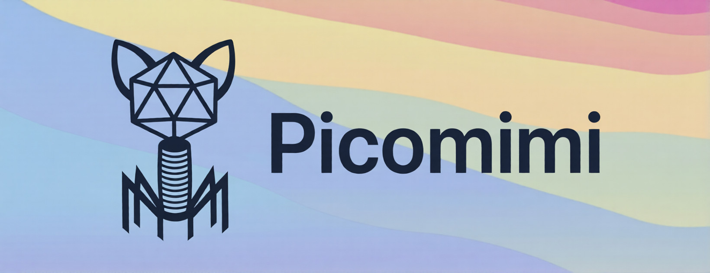

# Picomimi MicroOS

---

## ⚠️ Project Status: Extended Hiatus

**Picomimi is on an extended development break.**

This project began as a small Arduino IDE sketch and grew into a ~12,000-line monolithic codebase. An attempt to migrate to pico-sdk did not succeed. Picomimi is now being rebuilt entirely from the ground up, incorporating all knowledge and experience gained throughout its development. The objective is a clean, professional, and maintainable architecture.

During this period, foundational work is being done to extend Picomimi's support beyond the RP2040/RP2350 to additional ARM Cortex-M platforms, including **Nordic nRF** and **STM32** families.

Picomimi is a fun lil project. During this hiatus, redesigning Picomimi, just to cater to a wider range of Cortex-M MCUs, I'm working on a silly fork, [github.com/MilkmanAbi/Picomimi_x64](https://github.com/MilkmanAbi/Picomimi_x64). Picomimi is copying a lot of Linux Syscall names and ABI to self host Hierarchical schedulers, process management, and potentially some cool little ports of apps.

The project is silly in the sense that it has no reason to exist, proffessional RTOSes exist, and it knows, it's silly and that's fine. This project isn't too serious nor too high achieving, just me messing with Kernel ideologies, and coding for fun OwO

### Ecosystem Projects

The following projects are being developed to support Picomimi's future:

| Project | Description | Repository |
|---------|-------------|------------|
| **MimiK** | Platform abstraction libraries for multi-architecture ARM support | [github.com/MilkmanAbi/MimiK](https://github.com/MilkmanAbi/MimiK) |
| **MimiSort** | Mathematical coprocessing and sorting algorithms for the high-efficiency Dynamic Memory Allocator | [github.com/MilkmanAbi/MimiSort](https://github.com/MilkmanAbi/MimiSort) |
| **MimiC** | On-device C compiler for native program compilation and execution | [github.com/MilkmanAbi/MimiC](https://github.com/MilkmanAbi/MimiC) |
| **MimiBoot** | Bootloader with A/B recovery partitions and runtime ELF loading | [github.com/MilkmanAbi/MimiBoot](https://github.com/MilkmanAbi/MimiBoot) |

### Project Philosophy

Picomimi is clear about what it is: **a complete embedded distribution**, not a certification-ready commercial RTOS.

Unlike projects such as Zephyr, Picomimi makes no claims of safety certification, functional safety compliance, or formal verification. It is provided as-is for experimentation, education, and hobbyist use. Users are free to fork, modify, extend, or repurpose Picomimi in any way they see fit—including experimental features, unconventional architectures, or use cases that would not be appropriate for safety-critical systems.

This is intentional. Picomimi exists to be explored, broken, and rebuilt.

---

> **A complete embedded distribution for RP2040 / RP2350**
> Kernel, scheduler, filesystem, shell, and SDK in one coherent platform.



---

## What is Picomimi?

Picomimi is a **full microOS distribution** for RP2040 and RP2350 MCUs.
It is not a minimal RTOS and not a single-threaded sketch. It is a complete embedded platform that includes:

* **Dual-core preemptive scheduler** with O(1) priority queues
* **PMFS journaling filesystem** with dual OTA banks and `tmpfs`
* **Interactive shell** for real-time system inspection and control
* **Hardware abstraction layers (HALs)** decoupling kernel logic from MCU registers
* **Per-task memory accounting** with automatic resource cleanup
* **Priority-aware IPC** for deterministic inter-task communication

Unlike minimal kernels that require you to assemble everything yourself, Picomimi provides a persistent, inspectable system where tasks, memory, peripherals, and IPC can be observed and controlled at runtime.

## 🌸 Picomimi Project
[Explore Picomimi](https://milkmanabi.github.io/Picomimi/)

---

## Current Status — v15.0 (In Development)

**The Great Refactor**

Picomimi is being migrated from a ~12,000-line monolithic codebase into a structured, modular architecture built on **pico-sdk**.

Work currently includes:

* Native pico-sdk foundation (no Arduino core dependency)
* Clean directory structure: `src/`, `include/`, `drivers/`, `apps/`
* Proper HAL and driver interfaces
* Performance improvements from native C/C++ code
* Future packaging as a standalone Arduino library (without Arduino core dependency)

Alpha ports are work-in-progress and **non-functional**.
The v14.3.1 feature set is being ported to the new architecture.

ฅ(•ㅅ•❀)ฅ

---

## Architecture

Picomimi is a **dual-core microkernel at the center of a complete embedded distribution**:

```
┌─────────────────────────────────┐
│   Apps & User Space Tasks       │  Peripheral handlers, timers, displays
├─────────────────────────────────┤
│   Shell & SDK                   │  Interactive control, APIs
├─────────────────────────────────┤
│   PMFS Filesystem               │  Journaling, OTA, tmpfs
├─────────────────────────────────┤
│   IPC & Memory Manager          │  Message passing, kmalloc/kfree
├─────────────────────────────────┤
│   O(1) Scheduler (Dual Core)    │  Preemptive multitasking
├─────────────────────────────────┤
│   Hardware Abstraction Layer    │  MCU register abstraction
└─────────────────────────────────┘
```

### Key Components

* **Scheduler**
  O(1) priority-based preemptive multitasking across both cores

* **Memory Management**
  Per-task heap tracking, OOM handling, automatic cleanup on task exit

* **PMFS Filesystem**
  Transactional journaling, write caching, A/B firmware banks, RAM disk

* **IPC**
  Message passing, signals, and shared memory primitives

* **HAL**
  Clean separation between kernel logic and hardware registers

---

## What Makes Picomimi Different

| Feature       | FreeRTOS    | Arduino       | Picomimi                      |
| ------------- | ----------- | ------------- | ----------------------------- |
| Structure     | Kernel only | Superloop     | Full OS distribution          |
| Filesystem    | 3rd party   | Library       | Native PMFS (journaled)       |
| Shell         | 3rd party   | None          | Interactive, built-in         |
| Process model | Tasks       | Single thread | Tasks with resource ownership |
| Development   | C/C++       | C++ sketch    | C/C++ SDK + library           |
| Focus         | Efficiency  | Simplicity    | Inspectability & completeness |

Picomimi is designed as a system-level embedded platform rather than a minimal RTOS or a superloop-based framework.

Its architecture more closely resembles a small Unix-like embedded environment, providing a kernel, filesystem, shell, services, and user-space tasks as a unified system.

---

## Philosophy

Picomimi is built around **transparency, modularity, and serious engineering**:

1. Modular design with clear separation of kernel, drivers, and applications
2. Inspectable systems with visibility into tasks, memory, IPC, and peripherals
3. Hardware abstraction to keep kernel logic independent of MCU registers
4. Native performance through direct use of pico-sdk
5. Long-term structure rather than short-term convenience

The goal is a **robust embedded foundation** for learning, prototyping, and building complex systems without excessive boilerplate.

---

## Building

Current workflow using pico-sdk:

```bash
mkdir build && cd build
cmake ..
make
```

Arduino IDE support is temporarily paused during the refactor and will return as a packaged library.

---

## Shell Access

Connect via USB serial:

```bash
picocom /dev/ttyACM0 -b 115200
```

The interactive shell allows inspection and control of the kernel, task management, filesystem access, and live debugging.

---

## Project Goals

1. De-monolith the codebase into maintainable modules
2. Build on native pico-sdk for performance and control
3. Implement proper HALs for supported peripherals
4. Package as a standalone Arduino library while retaining pico-sdk support
5. Enable collaborative development with clean architecture and CI

---

## Note on AxisOS

Picomimi and AxisOS are tightly connected and influence each other heavily.
The distinction between the two will be clarified in future updates.

---

## Why Picomimi Was Made

Because I'm struggling with even basic Computer Engineering, I have no idea what I'm doing half the time at school. I like to code. I was given a few RP2040 boards, and I started building things. This project grew from that. Yep.

---

## Other Projects

Picomimi makes extensive use of several of **my own projects**, including:

* **[MimiC](https://github.com/MilkmanAbi/MimiC)** — the on-device C compiler and systems language (work-in-progress)
* **[AxisOS](https://github.com/MilkmanAbi/AxisOS)** — a complete derivative of Picomimi, currently under development, empty
* **[Pico-Governor](https://github.com/MilkmanAbi/pico-governor)** — A partial derivative of Picomimi, currently under development, an utility for Dynamic Power Management on Raspberry Pico Silicon

Future **Picomimi v16.0+** releases will gradually and experimentally integrate MimiC, reusing these projects to broaden the capabilities of this MicroOS.

---

**Made with ambition, persistence, and a love for embedded systems**
ฅ(•ㅅ•❀)ฅ

---
